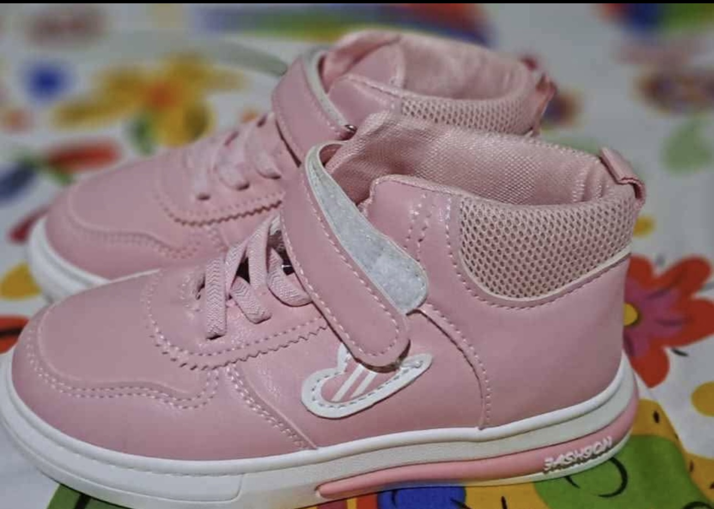
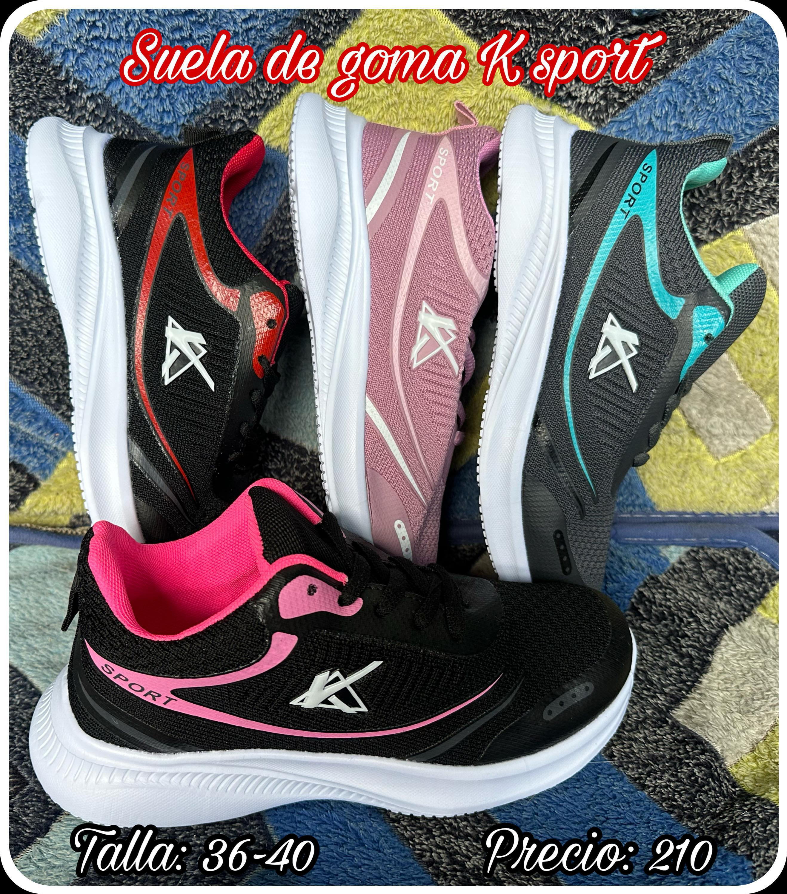
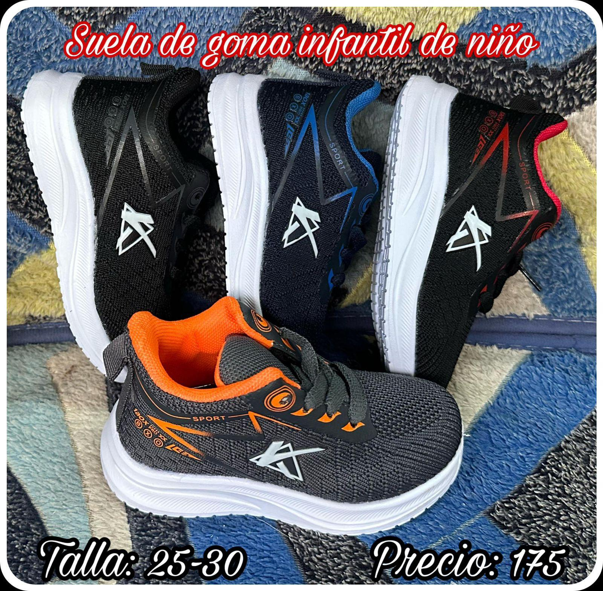
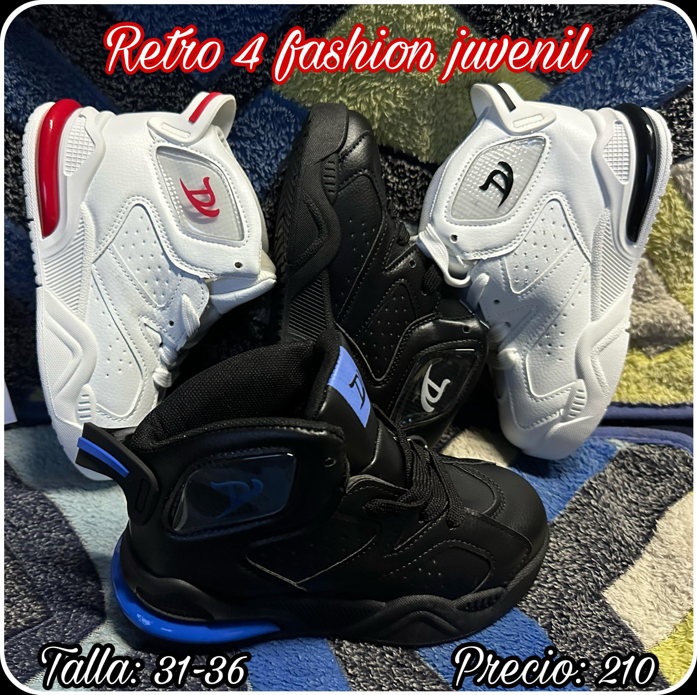
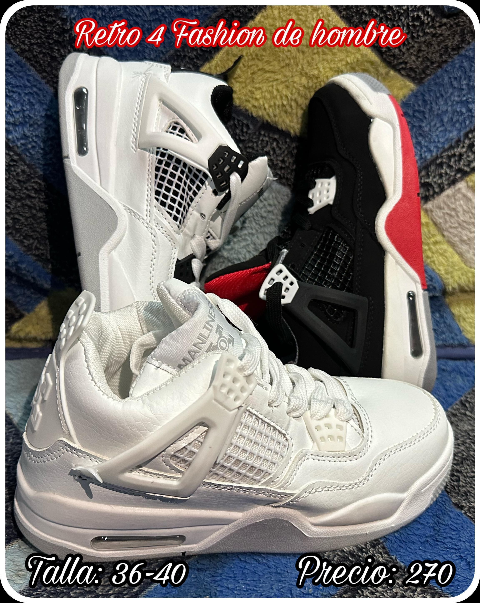

<html lang="es">
<head>
    <meta charset="UTF-8">
    <meta name="viewport" content="width=device-width, initial-scale=1.0">
    <title>calzado narvaez castro </title>
    
</head>
<body>
    <header>
        <h1>BIENVENIDOS </h1>
      
<html>
<head>

</head>
<body>

  

   

<a href="https://ice2606.github.io/pagina-002/" class="boton-verde">
  <button>Ir atras</button>
</a>

<html>
<head>

</head>
<body>

</body>
</html>

<html lang="es">
<head>
  <meta charset="UTF-8">
  <meta name="viewport" content="width=device-width, initial-scale=1.0">
  <title>Producto Destacado</title>
  
</head>
<body>
  

    
    

    zapatos rosa estilo botin 
    

    <a href="https://wa.me/50589906649?text=Hola%2C%20me%20interesa%20el%20producto%20de%20tu%20sitio%20web." class="whatsapp-link" target="_blank">
      Consultar por WhatsApp
    </a>
  

</body>
</html>

<body>
  

    
    

      zapatos de goma color negro deportivos 
    

    <a href="https://wa.me/50589906649?text=Hola%2C%20me%20interesa%20el%20producto%20de%20tu%20sitio%20web." class="whatsapp-link" target="_blank">
      Consultar por WhatsApp
    </a>
  

</body>

<body>
  

    
    

     zapatos color negro suela de goma deportivos 
    

    <a href="https://wa.me/50589906649?text=Hola%2C%20me%20interesa%20el%20producto%20de%20tu%20sitio%20web." class="whatsapp-link" target="_blank">
      Consultar por WhatsApp
    </a>
  

</body>

<body>
  

    
    

      retro 4 fashion
    

    <a href="https://wa.me/50589906649?text=Hola%2C%20me%20interesa%20el%20producto%20de%20tu%20sitio%20web." class="whatsapp-link" target="_blank">
      Consultar por WhatsApp
    </a>
  

</body>

<body>
  

    
    

     retro 4 unisex 
    

    <a href="https://wa.me/50589906649?text=Hola%2C%20me%20interesa%20el%20producto%20de%20tu%20sitio%20web." class="whatsapp-link" target="_blank">
      Consultar por WhatsApp
    </a>
  

</body>

